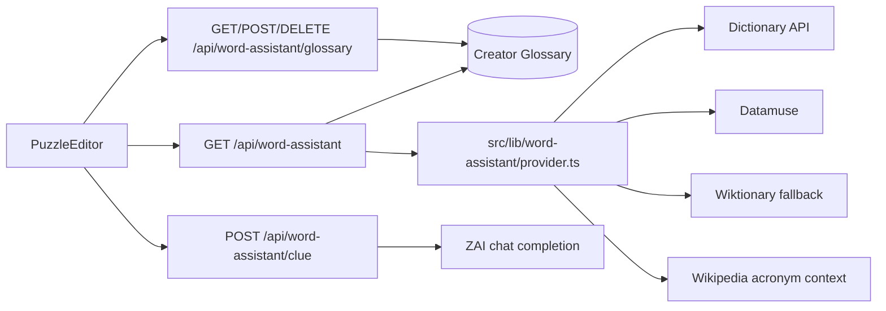

# Word Assistant

The Word Assistant gives puzzle creators an in-editor research tool for checking word definitions, examples, related words, acronyms, and crossword-style clue ideas.

It is available from the creator puzzle editor in `PuzzleEditor`. A creator can search a word manually or start from an answer already present in a clue card. Results can be used as research, copied into a clue, converted into an AI-generated crossword clue, or saved to the creator's personal glossary.

## Capabilities

The current implementation supports:

- French and English word lookups.
- Definitions, parts of speech, and examples.
- English related words from Datamuse.
- Acronym context from Wikipedia when the search term looks like an acronym.
- Wiktionary summary fallback when the primary dictionary has no result.
- AI-generated crossword clue suggestions.
- Three clue alternatives with standard, humorous, or cryptic styles and easy, medium, or hard difficulty.
- Creator-specific glossary entries.
- Applying a definition or generated clue directly to the active clue.
- Copying definitions and examples, with `Ctrl+Shift+D` or `Cmd+Shift+D` lookup support.
- JSON glossary import and export.
- Ten-minute in-process result caching.
- A limit of 30 lookups per creator per minute.

The assistant is creator-only. Every assistant endpoint requires the `CREATOR` role, which also allows administrators through the existing role hierarchy.

## User Workflow

1. Open the puzzle editor.
2. Select or enter an answer in a clue card.
3. Select **Chercher** to look up the answer, or open the assistant header and search manually.
4. Review definitions, examples, related words, or acronym context.
5. Choose one of the available actions:
   - Use the definition as the clue.
   - Ask the AI to suggest a concise crossword clue.
   - Use the generated suggestion as the clue.
   - Save the definition to the personal glossary.
6. Continue editing the puzzle normally. Clue changes remain part of the existing autosave flow.

The assistant is collapsed by default so it does not consume the clue editor's vertical space. A lookup expands it automatically. Results scroll inside a bounded panel.

## Architecture



The route layer handles authentication, validation, rate limiting, and persistence. Provider-specific HTTP calls and response normalization live in `src/lib/word-assistant/provider.ts`.

## Source Files

| File | Responsibility |
| --- | --- |
| `src/components/crossword/PuzzleEditor.tsx` | Assistant UI, lookup actions, result actions, clue insertion, glossary save state |
| `src/lib/word-assistant/provider.ts` | External provider calls, normalization, fallback logic, and cache |
| `src/lib/word-assistant/clues.ts` | Parses and validates AI-generated clue alternatives |
| `src/app/api/word-assistant/route.ts` | Authenticated lookup endpoint, glossary-first lookup, rate limiting |
| `src/app/api/word-assistant/clue/route.ts` | AI crossword clue generation endpoint |
| `src/app/api/word-assistant/glossary/route.ts` | Creator glossary CRUD endpoint |
| `prisma/schema.prisma` | `GlossaryEntry` model and creator relation |
| `tests/word-assistant-provider.test.ts` | Provider contract tests with mocked HTTP responses |

## Lookup API

### Request

```http
GET /api/word-assistant?term=maison&language=fr
```

Supported languages are `fr` and `en`. Any value other than `en` is treated as `fr` by the current route. Terms must be between 1 and 80 characters.

### Authentication responses

- `401`: no authenticated session.
- `403`: authenticated user does not have creator-level permissions.
- `400`: missing or oversized term.
- `429`: creator exceeded 30 lookups in the current one-minute window.

### Normal provider response

```json
{
  "term": "house",
  "language": "en",
  "definitions": [
    {
      "partOfSpeech": "noun",
      "definition": "A building constructed for human habitation.",
      "example": "They bought a house near the park."
    }
  ],
  "synonyms": ["home", "residence"],
  "acronym": null,
  "source": "Dictionary API, Datamuse et Wikipedia"
}
```

The provider limits normalized definitions to eight entries and related words to eight entries.

### Provider order

1. Dictionary API is queried first:
   - English: `https://api.dictionaryapi.dev/api/v2/entries/en/{term}`
   - French: `https://api.dictionaryapi.dev/api/v2/entries/fr/{term}`
2. If the language is English, Datamuse supplies related words.
3. If the term is two to twelve uppercase letters or digits, Wikipedia summary data is checked for acronym context.
4. If Dictionary API returns no definitions, the localized Wiktionary summary endpoint is used as a fallback.

All external requests have a five-second timeout and failed providers return an empty result rather than crashing the route.

## Glossary-First Lookup

Before calling public providers, the lookup route searches `GlossaryEntry` by:

- authenticated creator ID
- normalized lowercase term
- language

When a match exists, the personal entry is returned as the result and public providers are skipped. This lets creators maintain project-specific meanings, abbreviations, and preferred wording.

Glossary results include:

```json
{
  "term": "api",
  "language": "en",
  "definitions": [{ "definition": "Application Programming Interface" }],
  "synonyms": [],
  "acronym": null,
  "source": "Glossaire personnel",
  "glossaryEntryId": "clx...",
  "savedClue": "Developer connection point"
}
```

If the glossary table is temporarily unavailable, the lookup route catches that database error and falls back to public providers. This protects normal lookups during a partial database rollout.

## Glossary API

All glossary endpoints require creator-level authentication and scope every operation to the current creator.

### List entries

```http
GET /api/word-assistant/glossary
GET /api/word-assistant/glossary?language=en
```

Response:

```json
{ "entries": [] }
```

### Save or update an entry

```http
POST /api/word-assistant/glossary
Content-Type: application/json
```

```json
{
  "term": "api",
  "language": "en",
  "definition": "Application Programming Interface",
  "example": "The app exposes a public API.",
  "clue": "Developer connection point"
}
```

The operation is an upsert using the compound key `(creatorId, term, language)`. Definitions are limited to 500 characters and terms to 80 characters.

### Delete an entry

```http
DELETE /api/word-assistant/glossary
Content-Type: application/json
```

```json
{ "id": "clx..." }
```

Deletion is scoped by both entry ID and creator ID.

## Database Model

`GlossaryEntry` is related to `User` through `creatorId`:

```prisma
model GlossaryEntry {
  id         String   @id @default(cuid())
  creatorId  String
  term       String
  language   String   @default("fr")
  definition String
  example    String?
  clue       String?
  createdAt  DateTime @default(now())
  updatedAt  DateTime @updatedAt

  creator User @relation(fields: [creatorId], references: [id], onDelete: Cascade)

  @@unique([creatorId, term, language])
  @@index([creatorId, language])
}
```

The unique constraint prevents duplicate terms in the same language for one creator while allowing different creators to maintain different definitions.

## AI Clue Generation API

### Request

```http
POST /api/word-assistant/clue
Content-Type: application/json
```

```json
{
  "term": "NASA",
  "definition": "United States space agency",
  "language": "en"
}
```

The endpoint validates the term and definition, then uses the existing `z-ai-web-dev-sdk` integration. The request may include `style` (`standard`, `humorous`, or `cryptic`) and `difficulty` (`easy`, `medium`, or `hard`). The prompt requests three concise alternatives and explicitly instructs the model not to include the answer.

### Response

```json
{ "clue": "US space agency, briefly", "clues": ["US space agency, briefly", "Space agency, briefly"] }
```

The client never replaces a clue automatically. The creator must choose **Utiliser** on one of the generated suggestions. Suggestions containing the answer, shorter than three characters, or longer than 160 characters are discarded.

The glossary manager supports local search, language filtering, inline editing, deletion, JSON export, and JSON import. Imported entries are sent through the authenticated glossary upsert endpoint, preserving creator ownership and preventing duplicates by term and language.

## Caching and Rate Limiting

Provider results are cached in the server process using a normalized `language:term` key.

- TTL: 10 minutes.
- Maximum entries: 100.
- Eviction: oldest inserted entry when the limit is exceeded.

The lookup route keeps a per-creator in-memory timestamp list:

- Window: 60 seconds.
- Maximum: 30 lookups per window.
- Response: HTTP `429` with `Retry-After: 60`.

These controls are intentionally lightweight. In a multi-instance deployment, each instance has its own cache and rate counter. A shared Redis or platform rate-limit service should replace them when the feature receives meaningful traffic.

## Environment and Database Setup

The application uses two PostgreSQL URLs:

- `DATABASE_URL`: Supabase pooler connection used by application queries.
- `DIRECT_URL`: direct PostgreSQL connection used by Prisma schema operations when reachable.

Because the pooler uses transaction pooling, `DATABASE_URL` includes `pgbouncer=true`. Without it, Prisma prepared statement names can collide and produce errors such as:

```text
prepared statement "s15" already exists
```

After changing `prisma/schema.prisma`, run from the repository root:

```powershell
cd C:\Users\HP\wordfusion
npx prisma db push --accept-data-loss
```

Use this only after confirming the target database and backup situation. The current repository has migration-history drift, so `prisma migrate dev` may request a destructive reset. Do not run `prisma migrate reset` against the shared database.

## Testing

Run the provider tests with:

```powershell
npm test
```

The test file mocks `globalThis.fetch`, so tests do not call external services. Current coverage verifies:

- Dictionary response normalization.
- English related-word normalization.
- Wiktionary fallback behavior.
- Wikipedia acronym enrichment.
- Cache reuse for equivalent terms.
- AI clue parsing, fenced JSON handling, malformed response rejection, and answer-leak filtering.

Run the broader checks with:

```powershell
npx tsc --noEmit
npm run build
git diff --check
```

## Operational Considerations

- Public dictionary providers can change response formats or rate limits. Keep provider parsing isolated in `provider.ts`.
- Provider responses are not authoritative editorial content. Creators should review definitions before publishing clues.
- The AI endpoint can produce an imperfect or ambiguous clue. It is intentionally suggestion-only.
- In-memory cache and rate limiting reset whenever the server restarts.
- The glossary manager is embedded in the assistant and keeps its own bounded scroll area so it does not displace the clue editor.
- API keys are not required for the current public dictionary providers. The ZAI integration follows the existing project configuration.
- Never commit real database credentials or provider secrets to source control.

## Extension Points

Future provider additions should implement the same normalized result shape:

```ts
interface WordAssistantDefinition {
  partOfSpeech?: string;
  definition: string;
  example?: string;
}
```

Potential additions include:

- A dedicated acronym provider with broader expansion coverage.
- A paid editorial dictionary for higher-quality English definitions.
- A French synonym provider.
- Shared Redis caching and distributed rate limiting.
- Glossary search and bulk management.
- Automated API route tests with mocked authentication and Prisma.